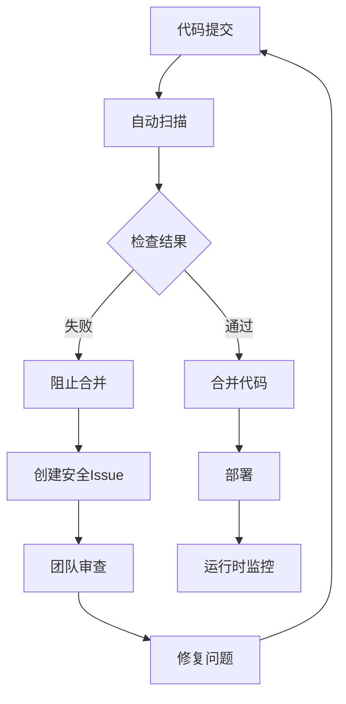

# 安全策略文档

## 🛡️ 安全概览

本文档概述了HuanuCanvas项目的安全策略和最佳实践，确保项目的安全性、可维护性和合规性。

## 📋 目录

- [安全目标](#安全目标)
- [安全架构](#安全架构)
- [安全工具和流程](#安全工具和流程)
- [敏感信息管理](#敏感信息管理)
- [依赖安全](#依赖安全)
- [代码安全](#代码安全)
- [容器安全](#容器安全)
- [访问控制](#访问控制)
- [监控和响应](#监控和响应)
- [合规性](#合规性)
- [事件响应](#事件响应)

## 🎯 安全目标

### 核心目标
- **机密性**: 保护敏感数据和知识产权
- **完整性**: 确保数据和代码的完整性
- **可用性**: 确保系统和服务的高可用性
- **合规性**: 遵循相关法律法规和行业标准

### 具体目标
- 零已知高危漏洞
- 100%的依赖安全性
- 完整的审计跟踪
- 快速的威胁响应
- 持续的安全改进

## 🏗️ 安全架构

### 多层防护策略
```
┌─────────────────────────────────────┐
│           应用层安全                   │
│  - 输入验证                         │
│  - 访问控制                         │
│  - 业务逻辑保护                     │
└─────────────────────────────────────┘
                  │
┌─────────────────────────────────────┐
│           基础设施安全                 │
│  - 网络隔离                         │
│  - 防火墙规则                       │
│  - DDoS防护                         │
└─────────────────────────────────────┘
                  │
┌─────────────────────────────────────┐
│           数据安全                     │
│  - 加密传输                         │
│  - 加密存储                         │
│  - 数据脱敏                         │
└─────────────────────────────────────┘
                  │
┌─────────────────────────────────────┐
│           身份认证和授权               │
│  - 多因子认证                       │
│  - 角色权限管理                     │
│  - 最小权限原则                     │
└─────────────────────────────────────┘
```

### 安全边界
- **网络边界**: 防火墙、VPN、专用网络
- **应用边界**: API网关、WAF、应用防火墙
- **数据边界**: 数据库加密、访问控制
- **用户边界**: 身份认证、会话管理

## 🔧 安全工具和流程

### 自动化安全工具

#### 1. 依赖安全扫描
- **工具**: npm audit, Snyk, Safety
- **配置**: [`.github/dependabot.yml`](./.github/dependabot.yml)
- **频率**: 每日扫描，自动更新
- **报告**: 依赖安全报告

#### 2. 代码安全分析
- **工具**: CodeQL, ESLint Security
- **配置**: [`.github/workflows/codeql-analysis.yml`](./.github/workflows/codeql-analysis.yml)
- **频率**: 每次PR推送时扫描
- **报告**: SARIF格式，GitHub Security标签

#### 3. 敏感信息检测
- **工具**: TruffleHog, GitLeaks, Git-Secrets
- **配置**: [`.github/workflows/secrets-scanning.yml`](./.github/workflows/secrets-scanning.yml)
- **频率**: 每次推送和每日定时扫描
- **报告**: 敏感信息扫描报告

#### 4. 容器安全扫描
- **工具**: Trivy, Docker Scout
- **配置**: 集成在CI/CD流程中
- **频率**: 每次构建时扫描
- **报告**: 容器安全报告

### 安全工作流


## 🔒 敏感信息管理

### 禁止内容
- ❌ API密钥和令牌
- ❌ 数据库连接字符串
- ❌ 私钥和证书
- ❌ 用户密码和哈希
- ❌ 个人敏感信息
- ❌ 内部系统凭据

### 允许使用的地方
- ✅ 环境变量
- ✅ GitHub Secrets
- ✅ 密钥管理服务
- ✅ 配置文件模板（.env.example）

### 环境变量规范
```bash
# ✅ 正确的环境变量命名
REACT_APP_API_BASE_URL=https://api.example.com
VITE_GEMINI_API_KEY=your-api-key
NODE_ENV=production

# ❌ 避免的命名
API_KEY=your-api-key  # 不明确是前端还是后端
SECRET=secret-value   # 太通用
PASSWORD=password123  # 太直接
```

### Secrets管理策略
1. **开发环境**: 使用.env文件和本地密钥
2. **测试环境**: 使用GitHub Secrets
3. **生产环境**: 使用专业的密钥管理服务
4. **密钥轮换**: 定期更新密钥（90天周期）

## 📦 依赖安全

### 依赖管理原则
- **最小化**: 只安装必要的依赖
- **更新**: 定期更新依赖包
- **审查**: 审查每个新增依赖
- **监控**: 持续监控依赖安全状态

### 依赖更新策略
- **安全更新**: 立即处理（24小时内）
- **补丁更新**: 每周处理
- **小版本更新**: 每月处理
- **大版本更新**: 按计划处理

### 依赖审查清单
- [ ] 作者和维护者信誉
- [ ] 下载量和社区支持
- [ ] 最后更新时间
- [ ] 已知安全漏洞
- [ ] 许可证兼容性
- [ ] 代码质量和测试覆盖率

## 💻 代码安全

### 安全编码标准
- **输入验证**: 验证所有用户输入
- **输出编码**: 防止XSS攻击
- **错误处理**: 不泄露敏感信息
- **日志记录**: 记录安全相关事件
- **并发安全**: 正确处理并发访问

### 安全代码示例
```javascript
// ✅ 好的做法 - 输入验证
function validateUserInput(input) {
  // 白名单验证
  const allowedChars = /^[a-zA-Z0-9\s]+$/;
  if (!allowedChars.test(input)) {
    throw new Error('Invalid characters in input');
  }
  return input.trim();
}

// ❌ 避免的做法 - SQL注入
function getUserById(id) {
  return db.query(`SELECT * FROM users WHERE id = ${id}`);
}

// ✅ 好的做法 - 参数化查询
function getUserById(id) {
  return db.query('SELECT * FROM users WHERE id = ?', [id]);
}
```

### 安全测试
- **单元测试**: 测试安全相关的函数
- **集成测试**: 测试API端点安全
- **渗透测试**: 定期进行安全测试
- **代码审查**: 每次PR都进行安全审查

## 🐳 容器安全

### Docker安全最佳实践
- **最小镜像**: 使用Alpine Linux或distroless镜像
- **非root用户**: 在容器内使用非特权用户
- **只读文件系统**: 容器文件系统设为只读
- **网络隔离**: 最小化网络暴露
- **资源限制**: 限制CPU和内存使用

### Dockerfile安全示例
```dockerfile
# ✅ 好的做法 - 非root用户
FROM node:18-alpine
RUN addgroup -g 1001 -S nodejs
RUN adduser -S nextjs -u 1001
USER nextjs

# ❌ 避免的做法 - root用户
FROM node:18-alpine
RUN npm install -g package
```

## 🔐 访问控制

### 角色和权限
| 角色 | 权限 | 描述 |
|------|------|------|
| Owner | 完全控制 | 项目所有者 |
| Admin | 管理权限 | 管理员权限 |
| Maintainer | 写入权限 | 维护者权限 |
| Developer | 写入权限 | 开发者权限 |
| Guest | 只读权限 | 只读访问 |

### 分支权限
- **main**: 仅维护者可以合并
- **develop**: 开发者可以提交PR
- **feature/***: 功能分支，开发者控制
- **hotfix/***: 紧急修复，仅高级开发者

### 访问控制流程
1. **身份验证**: GitHub OAuth或SAML SSO
2. **授权检查**: 基于角色的访问控制
3. **权限验证**: 每次操作前验证
4. **审计日志**: 记录所有访问和操作

## 📊 监控和响应

### 安全监控
- **实时监控**: GitHub Security警报
- **定期扫描**: 每日自动化扫描
- **漏洞跟踪**: 持续跟踪已知漏洞
- **异常检测**: 检测异常活动和行为

### 安全指标
- **漏洞数量**: 按严重程度分类
- **修复时间**: 从发现到修复的时间
- **依赖状态**: 过时依赖的比例
- **合规性**: 安全策略遵循程度

### 响应流程
1. **检测**: 自动检测或手动报告
2. **评估**: 评估影响范围和严重程度
3. **隔离**: 立即隔离受影响的系统
4. **修复**: 实施修复方案
5. **恢复**: 恢复正常服务
6. **总结**: 总结经验教训

## 📋 合规性

### 遵循标准
- **OWASP Top 10**: Web应用安全风险
- **NIST Cybersecurity Framework**: 网络安全框架
- **ISO 27001**: 信息安全管理体系
- **GDPR**: 通用数据保护条例

### 合规检查清单
- [ ] 数据加密（传输和存储）
- [ ] 访问控制和身份验证
- [ ] 审计日志和监控
- [ ] 事件响应计划
- [ ] 定期安全评估
- [ ] 员工安全培训

## 🚨 事件响应

### 安全事件分类
- **P0 - 严重**: 生产系统被入侵
- **P1 - 高**: 敏感数据泄露
- **P2 - 中**: 中等安全风险
- **P3 - 低**: 一般安全建议

### 响应时间目标
- **P0**: 15分钟内响应
- **P1**: 1小时内响应
- **P2**: 24小时内响应
- **P3**: 72小时内响应

### 事件响应步骤
1. **立即响应**: 确认事件并启动响应
2. **评估影响**: 确定影响范围
3. **制定计划**: 制定响应和恢复计划
4. **执行修复**: 实施修复措施
5. **监控恢复**: 确保系统恢复正常
6. **事后分析**: 分析事件原因和教训

## 🔗 相关资源

### 安全工具
- [GitHub Security](https://github.com/features/security)
- [OWASP Top 10](https://owasp.org/www-project-top-ten/)
- [NIST Cybersecurity Framework](https://www.nist.gov/cyberframework)
- [Snyk Vulnerability Database](https://snyk.io/vuln)

### 安全文档
- [Security Policy](./SECURITY_POLICY.md)
- [Vulnerability Disclosure](./VULNERABILITY_DISCLOSURE.md)
- [Security Best Practices](./SECURITY_BEST_PRACTICES.md)

### 培训和资源
- [GitHub Security Lab](https://securitylab.github.com/)
- [Security Training](https://training.github.com/)
- [Security Community](https://github.community/c/security/41)

## 📞 联系方式

### 安全团队
- **安全负责人**: @tcJackClay
- **安全邮箱**: security@huanucanvas.com
- **紧急联系**: +86-xxx-xxxx-xxxx

### 报告安全问题
如发现安全问题，请:
1. 不要公开报告
2. 发送邮件到 security@huanucanvas.com
3. 包含详细描述和重现步骤
4. 我们将在24小时内回复

---

**最后更新**: 2024-01-27  
**版本**: 1.0.0  
**下次审查**: 2024-04-27